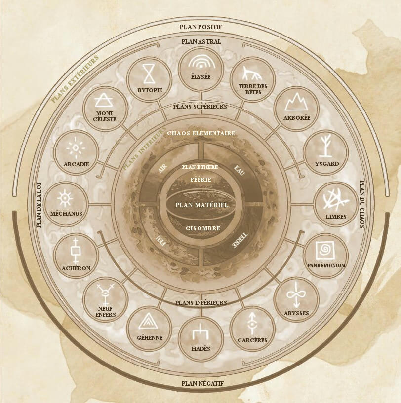
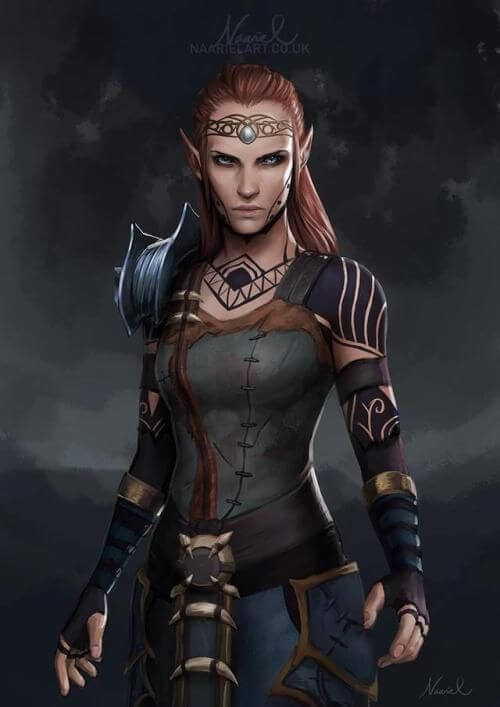
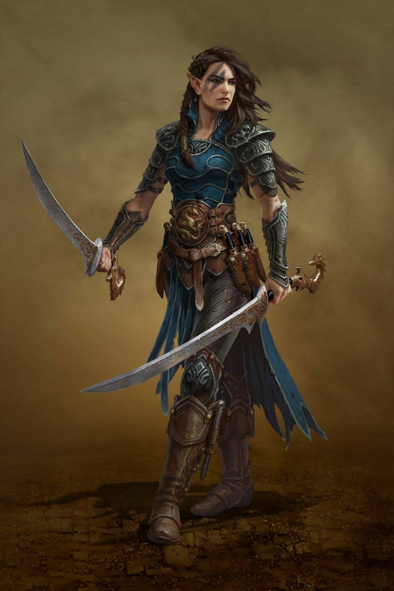
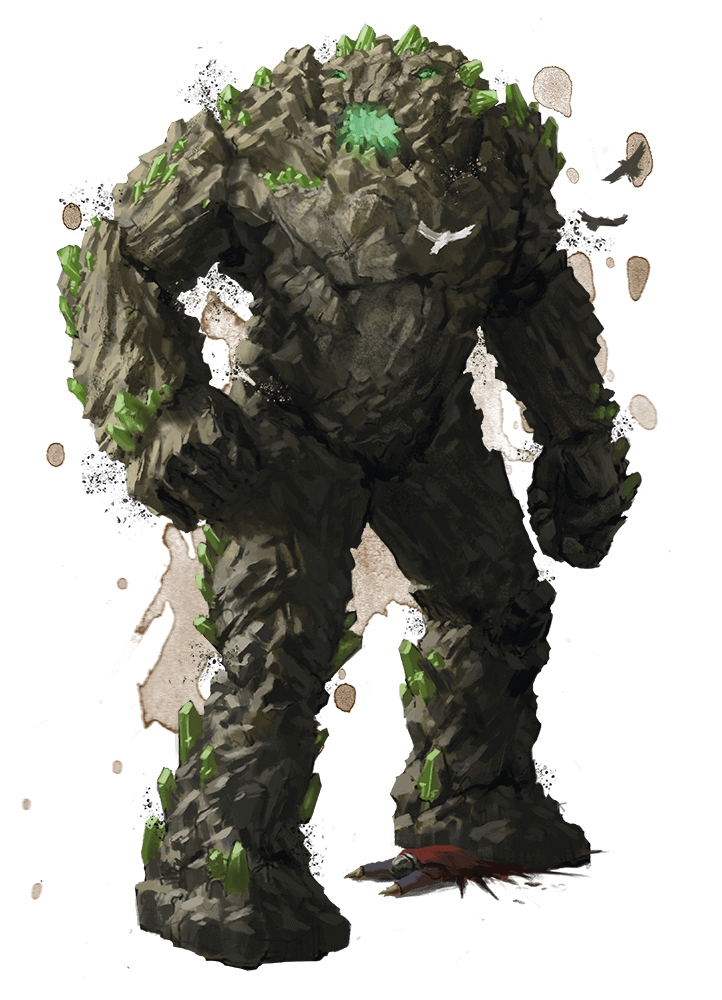
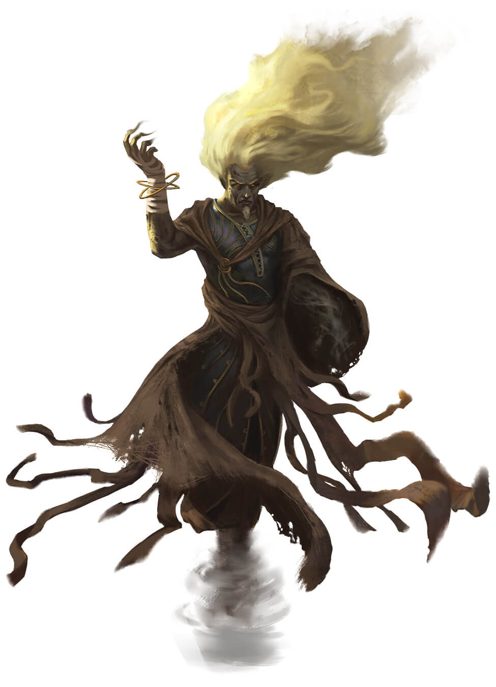
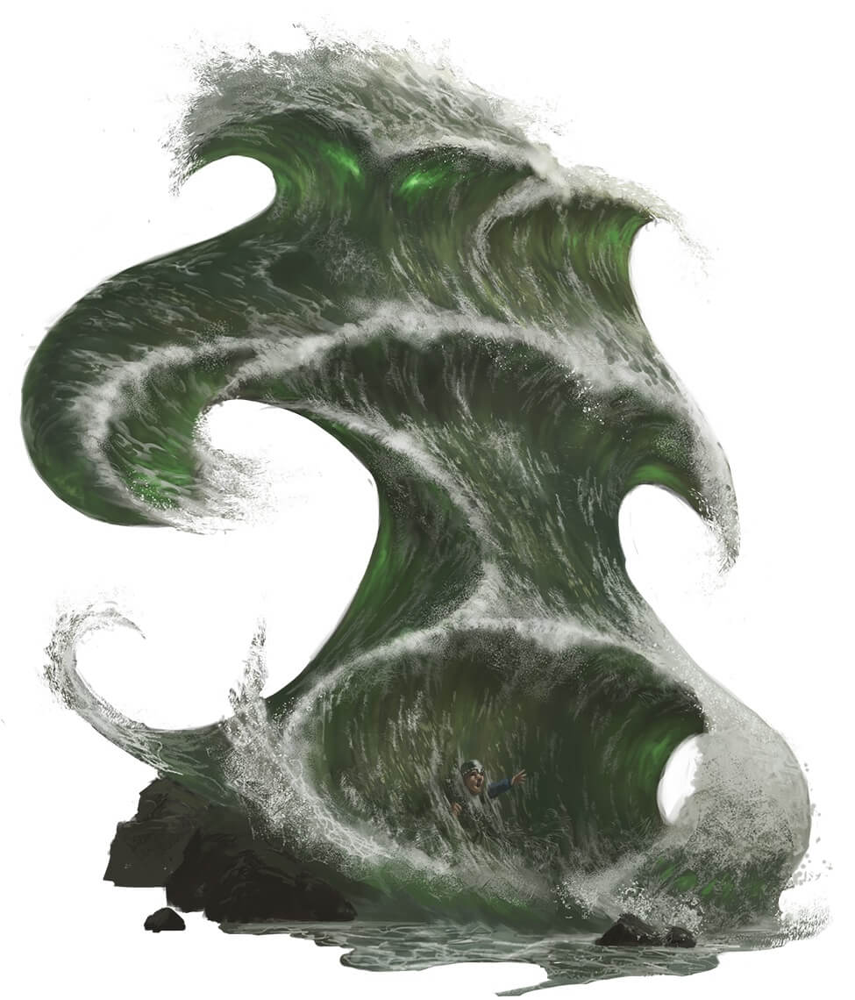
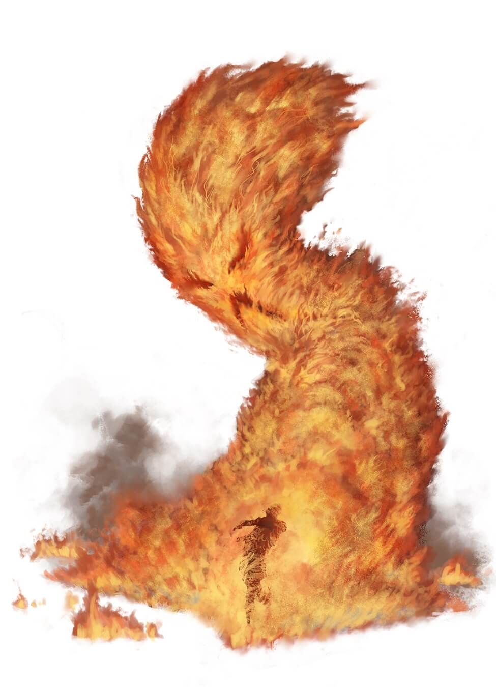

# Séance 3

## Campagne

D&D 5 - Princes of Apocalypse Revisited

## Date

15/12/2019

## Lieu

Maison d'Alexandre

## MJ

Cyril

## Joueurs présents

Alex => Qerrak (niveau 4)  
Emily => Ura (niveau 4)  
JS => Lysianna (niveau 4)  
Julien => Albérich (niveau 4)  
Remy => Robin (niveau 4)  
Sébastien => Drachen (niveau 4)  

## Partie

### Résumé

L'intégralité du groupe a accepté d'être transporté avec **Ara** dans sa citée.

Un puissant sort de téléportation les transporte donc à `Neménora`.

Le spectacle est grandiose. IL s'agit d'une ville fortifiée à flanc de montagne, mais au dessus des nuages, pratiquement au sommet.

Un puissant sort de magie protège du climat naturel, et seul **Qerrark** fut assez imprudent pour essayer de passer outre le dôme protecteur.

A leur arrivée, le groupe se trouve à l'entrée de la citadelle, et les gardes les accueillent de manière circonspecte.

Le responsable de la garde est en grande discussion avec **Ara** et lui reproche d'être partie sans prévenir, ainsi que d'avoir amener avec elle un groupe d'étranger.

Les hauts-elfes parlent un ancien dialecte elfe, et ceux du groupe qui parlent l'elfe ont bien du mal à déchiffrer ces échanges.  
Ils apprennent tout de même qu'**Ara** est la nièce du roi **Erevan Sariel** et l'une des principales mages de la cité.

Le groupe est conduit dans une bâtisse au nord-est de la ville et se rendent compte qu'il s'agit en fait d'un avant-poste, qui de plus n'est pas sur le même plan.

**Robin** est très surpris car il se rend compte qu'il se trouve sur le même plan que l'entité avec laquelle il s'est lié. `Le plan de la féérie`.

**Ara** doit débriefer auprès de sa responsable, et quitte le groupe qui se restaure dans des quartiers communs et entame un spectacle qui leur vaut la désapprobation des elfes de passage et de ceux présents dans la salle.

Environ 2h plus tard, arrivent **Ara** accompagné des dignitaires de la citée :

- La responsable des Mages : **Leshanna Nienor**  

- Le responsable des Guerriers : **Haradai Celebrimbor**  

- La responsable des Chasseurs : **Aredhelle Liadon**  

**Leshanna** prend la parole et explique au groupe qu'**Ara**, la nièce du roi **Erevan Sariel** a commis une folie en les ramenant à `Nemenora`.  
Que la citée est non seulement interdite d'accès aux étrangers mais qu'elle doit demeurer secrète.  
**Ara** a plaider en leur faveur et ainsi, plutôt que de subir un sort qui leur ferait perdre la mémoire et les renvoyer chez eux, il peuvent passer le rite des jeunes guerriers elfes.

Après une demi-journée à se promener en ville et à réfléchir à la proposition faite par le haut-conseil elfe, le groupe accepte et ainsi, **Leshanna** leur explique le mal qui couve selon eux.

Des évènements préoccupent les elfes et pensent que les élémentaires des 4 plans (feu/eau/air/terre) souhaitent envahir les plans dits matériels.

Pour cela les 4 princes élémentaires mauvais ont fait appel à des prophètes afin d'envahir et de combattre sur les autres plans :
- La terre : **Ogrémoch** => **Marlos Unrayle** (Prophète)  

- L'air : **Yan-C-Bin** => **Aerisi Kalinoth** (Prophète)  

- L'eau : **Olhydra** => **Gar Shaterkeel** (Prophète)  

- Le feu : **Imix** => **Vanifer** (Prophète)  

Les prophètes sont méconnus, mais les elfes pensent qu'ils auraient été choisis sur le plan matériel pour être les généraux des armés des princes du mal élémentaire.

**Ara** qui a eu une prémonition d'une guerre imminente (sous quelques années) s'est rendu dans le monde des Hommes afin d'y mener une enquête (contre l'avis des sages et de son roi).

Elle s'est faite surprendre avec un groupe de marchands aux abord de `Rouge Melèze`.
Ne souhaitant pas divulguer sa mission elle s'est laissée capturer, mais l'homme à la capuche qu'elle soupçonne être le prophète du culte de la terre, la contrainte et s'apprêtait à la sacrifier au nom de son prince.

Pour le moment, les puissances élémentaires n'ont pas la possibilité de pénétrer sur le plan matériel, mais l'avènement des prophètes est un signe indiscutable qu'ils recherchent les artefacts perdus leur permettant de faire traverser leurs armées.

Si ces 4 artefacts sont retrouvés par les prophètes et donnés aux princes, ceux-ci conquéront alors sans mal le plan matériel, et détruiront tout avant de s'abandonner dans une lutte fratricide très certainement.

Elle ne connait pas l'étendue des pouvoirs des artéfacts mais il est dit qu'il peuvent soit assoir le pouvoir des princes, soit les asservir...

Sa proposition est la suivante, passer le rite et si le groupe en sort vainqueur (ce dont elle doute fortement) le groupe pourra alors aider les hauts-elfes à découvrir où se trouvent les artéfacts de manière à ce qu'ils puissent être entre de bonnes mains.

**Haradai** prend alors la parole et explique en quoi consiste le rite de passage.  
Il s'agit d'un combat contre 6 elfes dotés de capacités équivalentes à ceux des aventuriers.

**Leshanna** se montre dédaigneuse, voire hostile envers le groupe, et est même injurieuse.

Ce n'est pas un combat à mort, chaque participant a un bracelet lui donnant 6 PV.
- chaque attaque si elle touche enlève 1PV
- chaque sort si il touche enlève 1PV
- 1 coup critique enlève 2PV
- 1 soin redonne 1PV
- JDS sur sort offensif => réussi 0PV, raté 1PV en moins

A 0 PV, la personne est considérée comme hors-combat.

Le groupe attend 2 jours que leurs adversaires rentrent de mission, et s'occupent dans la citée en attendant escorté par le garde **Adran**.

Le jour du rite, le groupe affronte :
- 1 guerrier spécialisé dans la défense
- 2 mages évocateurs
- 1 rôdeur ainsi que son compagnon animal panthère
- 1 roublard assassin
- 1 clerc spécialisé dans les sorts de soins

Bien que mis en difficultés dans les premières actions, avec notamment la pétrification d'**Ura**, le groupe réussi à mettre en déroute les combattants adversaires.

**Leshanna** furieuse de voire le combat échapper aux elfes, intervient et stoppe le rite.

Le groupe se présente ainsi fièrement devant le haut-conseil en attendant que lui soit confié sa première mission.

**`FIN DE LA SEANCE`**
