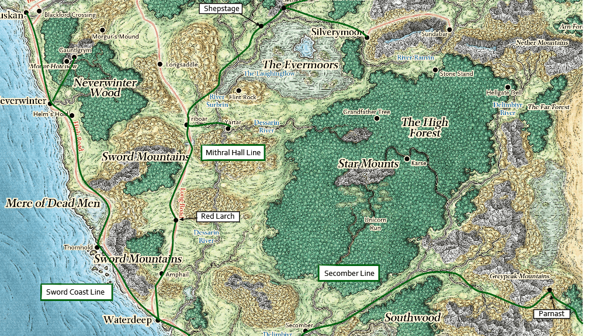
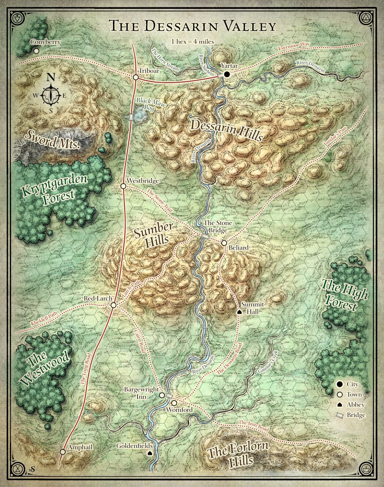
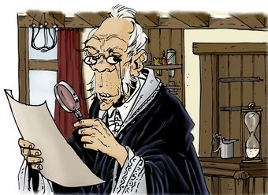
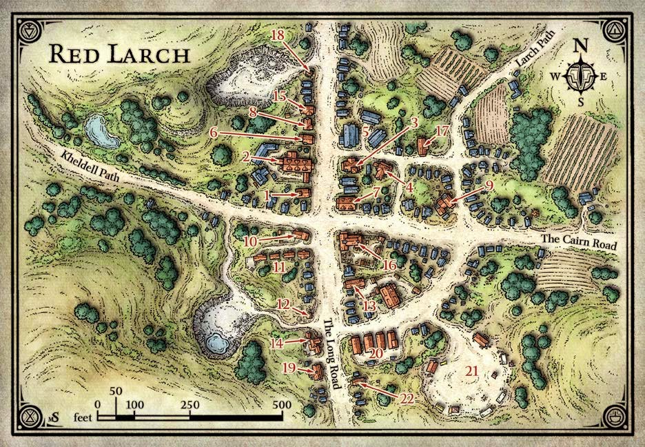
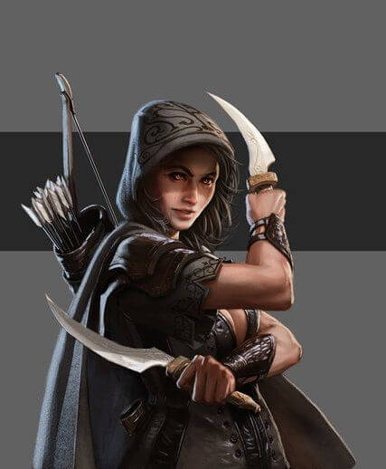
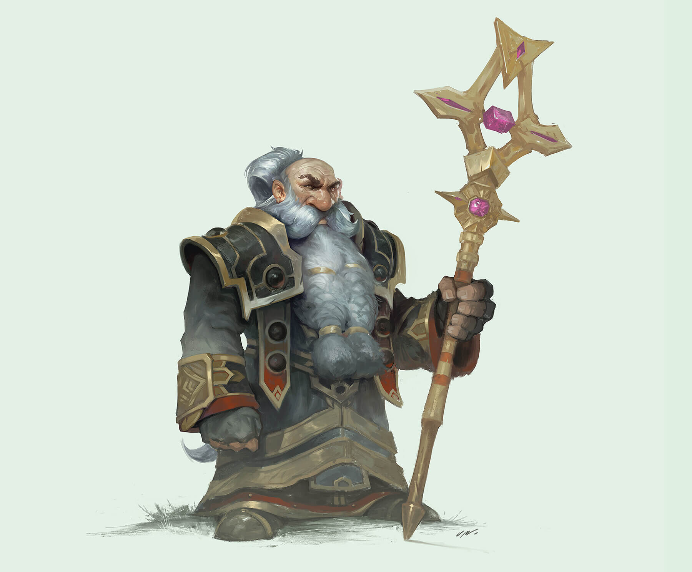
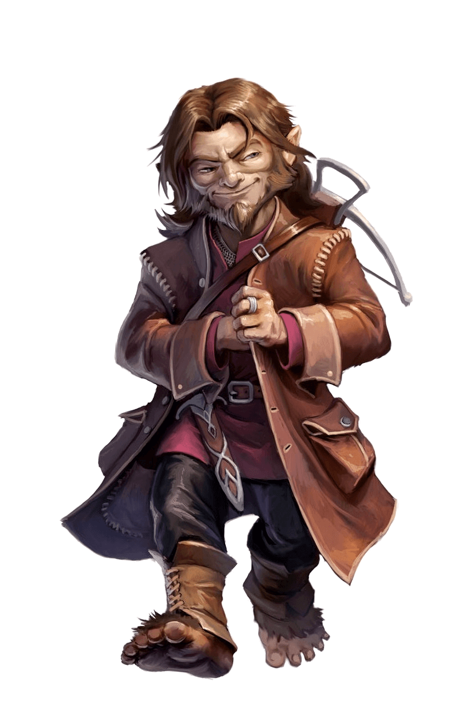
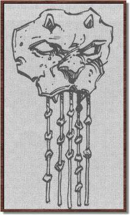

# 1. Séance 1

## Campagne

D&D 5 - Princes of Apocalypse Revisited

## Date

28/09/2019

## Lieu

Maison d'Alexandre

## MJ

Cyril

## Joueurs présents

Julien => Albericht (niveau 3)  
Nicolas => An (niveau 3)  
Remy => Robin (niveau 3)

## Partie

### Résumé

3 aventuriers venuent de `Waterdeep` se rendent à `Red Larch` dans la `Dessarin Valley` afin d'enquêter sur des disparitions de personnes.

`Sword Coast` (la côte des épées)  

`Dessarin Valley` (la valée Dessarin)  

A leur arrivée ils sont accueillis par un jeune homme au nom de **Gaétan** qui accueille tous les arrivants en leur demandant s'ils sont des aventuriers car **Maître Grassepath** a besoin de talents.

**Maître Grassepath** est un preteur sur gage assez agé, munis de lorgnons et vétu d'une robe noire à parement pourpres.

Celui-ci est inquiet car il attend le retour d'un halfling nommé **Merlo** avec qui il est en affaire pour lui rapporter un objet.

Les routes étant de plus en plus dangereuses, il souhaite faire appel à un groupe d'aventuriers capable de partir à la rencontre de **Merlo** sur la route, et ensuite de l'escorter jusqu'à `Red Larch`.

Nos 3 aventuriers acceptent la proposition de rémunération (20 PO) pour ce service, et se rendent en ville afin de s'informer sur la situation.

`Red Larch` est une bourgade très tranquille, avec un lieu de recueillement mais sans divinité particulière.

`Red Larch` (Rouge Mélèze)  

Les habitants sont accueillants et à l'image du bourgmestre **Richard Mercier**, la ville est secouée par les recentes disparitions, même si celles-ci semblent avoir surtout touchées les villes du nord pour le moment.

Après une nuit à l'auberge `l'épée oscillante`, tenue par une famille, ils se mettent en route en direction du Nord sur la route menant à `Westbridge`.

Le groupe ne devrait pas avoir à pousser jusqu'à `Triboar`, mais il se prépare à cette éventualité.

En tout le voyage ne devrait pas durer plus de 2 jours, une pour rejoindre **Merlo**, et une pour revenir sur `Red Larch`.

A la mi-journée du premier jour, des cris un peu à l'écart de la route attirent l'attention de nos aventuriers.

Ils se rendent sur place, et découvrent 2 personnes attachées et mise en joue par un groupe de malfrats.

Après un combat rapide et violent, face à 4 [Bandits](https://www.aidedd.org/dnd/monstres.php?vf=bandit) et grâce à la ruse de **Robin**, ils parviennent à libérer les 2 personnes.

Il s'agit de **Tordek Barbegelée** un nain prêtre serviteur du dieu nain, et d'une roublarde halfling nommée **Bree Lancepavée**.

Afin de les remercier de les avoir secourus, nos 2 personnages rejoignent le groupe afin de partir à la rencontre de Merlo.

Ils partent donc sur la route par le nord et rencontre, au bout d'une demi-journée, **Merlo** un jeune halfling.

Celui-ci ne semble pas effrayé de faire le chemin tout seul sur son chariot tiré par un baudet.

Pourtant il semble charrié bon nombre de colis et marchandises qui pourrait être convoité par quelques brigands.

Mais ses accointances avec un réseau très organisé, fait que s'attaquer à lui c'est se mettre dans une position délicate vis à vis de beaucoup de syndicats.

Après une nuit de bivouac, le retour à `Red Larch` se fait sans encombre.

A leur arrivé, le soir, **Maître Grassepath** les reçoit dans sa boutique et leur révèle que le colis demandé à **Merlo** contient le fameux **`Masque d'Utruz`**.

Celui-ci est censé contenir des indications liées au culte d'Utruz, secte qui sévissait dans la région il y a plusieurs centaines d'années et qui depuis fut détruites par les autorités de la région.

Ce masque contient le code permettant de traverser les souterrains du repaire Utruz sans encombre, afin d'accéder à une salle contenant le trésor Utruz enfermé depuis des siècles.

Des informations parvenues de `Waterdeep` à **Maître Grassepath** durant le trajet des aventuriers, fait état de la localisation de la secte d'Utruz (souterrain dans la vallée) et d'une clé nécessaire à l'ouverture de la salle au trésor.

Celle-ci serait localisée dans un temple abandonné creusé à flanc de collines à quelques heures de `Red Larch`.

**Maître Grassepath** espère que ces révélations vont pousses les aventuriers à acceoter cette nouvelle mission contre le partage des richesses du trésor.

Le groupe accepte et après un repas copieux préparé par la cuisinière de **Maître Grassepath**, le groupe se rend à l'auberge `l'épée oscillante` pour passer la nuit.

La curiosité de **Robin** le pousse à enquêter sur les marchandises de **Merlo**, mais l'un des jeunes fils de l'aubergiste monte la garde et ne permet pas au sorcier d'en apprendre d'avantage.

Dans la nuit, l'auberge est réveillée par les cris de **Gaétan**, qui hurle que la maison de **Maître Grassepath** est attaquée.

Le groupe se retrouve alors autour de la maison devant 10 [cultistes](https://www.aidedd.org/dnd/monstres.php?vf=cultiste) d'Utruz.

Ceux-ci essayent de forcer l'entrée, et hurlent qu'ils doivent récupérer leur bien, que nul ne doit entraver leur marche pour la domination du monde.

Après un combat très rapide et violent, le groupe réussi à capturer 1 acolyte, mais celui-ci apparemment conditionné se suicide avec une capsule de poison avant de pouvoir révéler des informations utiles.

Le lendemain, le groupe décide de partir à la recherche de la clé détenue dans le temple, puis de l'entrée du souterrain du culte.

**`FIN DE LA SEANCE`**

### Informations utiles

**`Le masque d'Utruz`**

=> 1 noeud correspond à une distance de 6 mètres

Cordelette verte : 4 noeuds  
Cordelette jaune : 3 noeuds  
Cordelette noire : 3 noeuds  
Cordelette rouge : 6 noeuds  
Cordelette bleue : 2 noeuds

La couleur mère de toutes, `le Noir`  
Puis celle de l’eau, l’élément principal, `le Bleu`  
Ensuite vient celle de la terre, `le Jaune`  
La suit l’âme du peuple utruz, `le Vert`  
Et pour terminer le sang des Hommes, `le Rouge`
