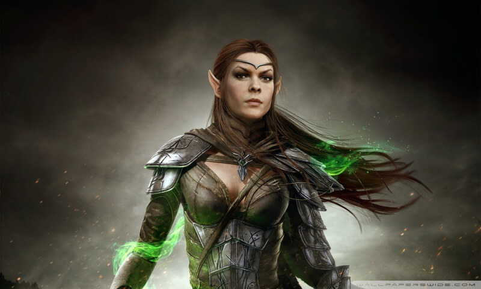

# 2. Séance 2

## Campagne

D&D 5 - Princes of Apocalypse Revisited

## Date

24/11/2019

## Lieu

Maison d'Alexandre

## MJ

Cyril

## Joueurs présents

Alex => Qerrak (niveau 3)  
Emily => Ura (niveau 3)  
JS => Lysianna (niveau 3)  
Julien => Albérich (niveau 3)  
Remy => Robin (niveau 3)  
Sébastien => Drachen (niveau 3)  

## Partie

### Résumé

**Tordek** et **Bree** quittent le groupe, car ils sont rappelés par leur confrérie (**`L'ordre du gantelet`**) suite à la disparition d'une délégation partie depuis `Mirabar`.  
**An Shin** quitte aussi le groupe pour se joindre à eux.

Donc il ne reste que **Robin** et **Albericht** qui décident d'attendre quelques renforts en provenance de `Waterdeep`.

**Maître Grassepath** décide d'envoyer une missive à `Waterdeep` afin que **Robin** et **Albérich** puissent obtenir quelques renforts pour leur mission vers le temple puis le repaire des `Utruz`.  
2 jours plus tard, arrivent à `Rouge Mélèze` 3 aventuriers répondant à la missive :

- **Drachen** (barbare)
- **Lysianna** (bardesse)
- **Ura** (moinesse)

**Maître Grassepath** les accueillent, et le groupe part ensuite en direction du temple pour récupérer la clé Utruz leur permettant d'accéder au repaire.

En chemin il font la rencontre de **Qerrark**, un guerrier Aarakocra qui s'associe à eux.

#### Temple

Creusé à flanc de colline l'entrée est gardée par 2 [cultistes](https://www.aidedd.org/dnd/monstres.php?vf=cultiste).

Sans mal et de manière très discrète, le groupe réussi à les neutraliser, et décide de tendre un piège à d'éventuels renforts à l'intérieur du temple.

A l'intérieur se trouve :

- 10 [cultistes](https://www.aidedd.org/dnd/monstres.php?vf=cultiste)
- 4 [acolytes](https://www.aidedd.org/dnd/monstres.php?vf=acolyte)
- 2 [gargouilles](https://www.aidedd.org/dnd/monstres.php?vf=gargouille)
- 1 grand [prêtre](https://www.aidedd.org/dnd/monstres.php?vf=pretre)

**Ura** vétue de la tenue d'un des acolytes réussi à attirer les `Utruz` à l'extérieur, et le combat tourne court, nos aventuriers ayant rapidement le dessus.

Quelques pièces d'or sont trouvées sur les corps et au sein du temple, ainsi qu'un coffre contenant :

- des gemmes non taillées estimées à 150 PO par **Albérich**
- 1 parchemin

Sur le parchemin il est écrit l'emplacement exact de l'entrée du lieu de culte Utruz.  
Pour ouvrir il faut donner la réponse à cette énigme décrite en élémental sur le parchemin :

> Je détruit tout : os, chair et vie.  
> Jamais je ne me repose car je suis infini.  
> Ni l'acier des armes, ni la roche des montagnes ne me résistent.  
> Dévoreur sans fin, mon appétit n'a pas de limite.

Une fouille plus minutieuse d'un des pilier permet de découvrir un coffret contenant 2 anneaux.

Après moultes tergiversations, le groupe décide de retourner à `Rouge Mélèze` compte tenu de l'heure tardive.  
Les aventuriers dorment à l'auberge sauf **Qerrark** qui niche sur l'auberge.

Le lendemain, le groupe se rend chez **Maître Grassepath** afin de relater ce qui c'est passé au temple, et vendent les gemmes à l'usurier.

Ensuite, la troupe se met en route du repaire des `Utruz`, en empruntant le `Passage des Mélèzes`, puis redescendre vers la `rivière dessarin`.  
Le voyage se déroule sans encombre, et au bout d'une journée et demie la marque des `Utruz` est identifiée sur la roche.

Avec beaucoup de panache **Lysianna** prononce la réponse à l'énigme en langue élémental (**`le temps`**) tout en touchant la roche de sa main.  
Elle disparaît instantanément.  
Tout à tour chaque aventurier effectue le même geste en prononçant le même mot.

Le groupe est alors téléporté dans un souterrain noir où ne peut jaillir aucune lumière, naturelle comme magique.  
Seul le masque `Utruz` est luminescent.

Le groupe se sert alors des instructions, recueillies par **Maître Grassepath** et comprend comment naviguer dans le noir complet ,tout en évitant des dangers mortels.

Le chemin est le suivant :

- 18 mètres tout droit
- A droite et 12 mètres
- A gauche et 18 mètres
- A gauche et 24 mètres
- A droite et 36 mètres

La lumière revient alors et le groupe se retrouve dans un passage étroit qui mène à une caverne.

Un homme cagoulé se tient au centre d'un promontoire et parle en élemental.  
Il remercie une centaine de cultistes présents dans la caverne, il leur explique que leur tâche est terminée.  
Une porte dimensionnelle est ouverte derrière lui et une femme est attachée par des liens magiques à coté de lui.  
Une dizaine de personnes se tiennent autour du promontoire, elles aussi cagoulées.

Pendant se temps, des gens de la région attachés sont forcés de traverser le portail.

A la fin du discours, les personnes cagoulées qui sont des mages activent un objet sur leur poignet, et des cercles de mort apparaissent ne laissant aucune chance aux acolytes d'`Utruz` qui meurent en quelques instants.  
Ensuite 8 d'entre-eux disparaissent dans le portail.

L'homme cagoulé demande aux 2 mages restants de s'occuper de la prisonnière.

Pendant ce temps, **Qerrark** s'envole directement en destination de la prisonnière afin de la libérer.  
Il décoche une flèche sur l'homme cagoulé afin d'attirer l'attention.

Ce dernier, indifférent à cette attaque, prononce en élémental `"occupez vous d'eux mes enfants"`, avant de franchir le portail et disparaître avec lui.

Les mages s'approchent de la prisonnière et dégaine des dagues pour la tuer.

**Qerrark** essaye de s'interposer, et le reste du groupe descend dans la caverne, les cercles de mort ayant disparus.

C'est alors que la pierre semble prendre vie, et se retrouve devant le groupe :

- 2 [gargouilles](https://www.aidedd.org/dnd/monstres.php?vf=gargouille)
- 2 [mages](https://www.aidedd.org/dnd/monstres.php?vf=lanceur-de-sorts-mage-niv-3)
- 1 [xorn](https://www.aidedd.org/dnd/monstres.php?vf=xorn)

Le combat est plus long que les précédents, mais les aventuriers s'en sortent haut la main, sans grandes blessures.

Le groupe libère la femme qui s'avère être une haute-elfe du nom de **Ara Meriel Galanodel**.

La pièce ne contient plus aucun trésor.

A sa libération **Ara** propose au groupe de les téléporter au sein de sa cité.

Malgré les réticences d'**Albérich** et de **Lysianna**, les aventuriers acceptent afin d'obtenir plus d'information sur ce qu'il vient de se passer.

**`FIN DE LA SEANCE`**

### Informations utiles

Les joueurs gagnent en tout `1800 points d'expérience` et passent **`Niveau 4`**.
