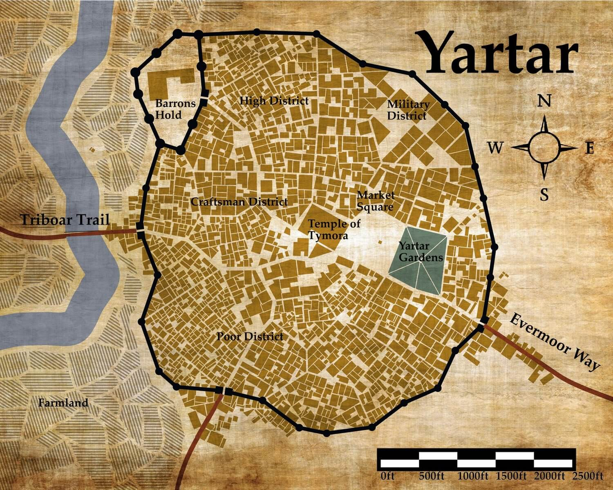
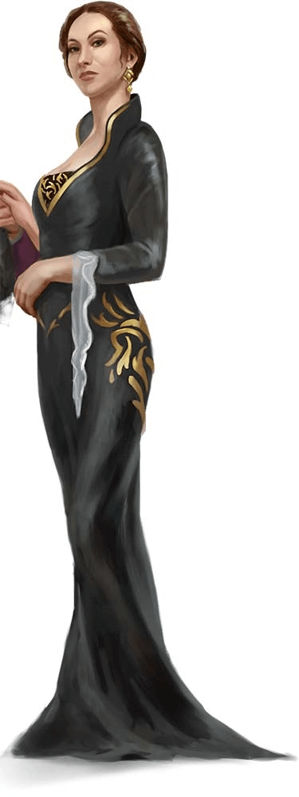

# 5. Séance 5

## Campagne

D&D 5 - Princes of Apocalypse Revisited

## Date

19/01/2020

## Lieu

Maison d'Alexandre

## MJ

Cyril

## Joueurs présents

Alex => Qerrak (niveau 5)  
Emily => Ura (niveau 5)  
JS => Lysianna (niveau 5)  
Julien => Albérich (niveau 5)  
Remy => Robin (niveau 5)  
Sébastien => Drachen (niveau 5)

## Partie

### Résumé

Le groupe passe une nuit tranquille dans la maison de **Aans** pendant qu'une tempête de neige fait rage au dehors.

Après avoir "emprunté" quelques denrées trouvées dans les placards, le groupe part au petit matin alors qu'un brouillard très dense entrave leur progression.

En milieu de matinée, le groupe croise la route d'une famille de [mammouths](https://www.aidedd.org/dnd/monstres.php?vf=mammouth).  
La mère mammouth protégeant son petit charge les aventuriers, qui la blessent en retour.  
**Lysianne** réussi à la faire fuir, mais dans un choc violent, l'objet désiré par **Rollo** a été endommagé.

Le groupe reprend son chemin, mais peu de temps après croise la route d'un groupe de trappeur, agacé d'avoir perdu la trace d'une famille de mamouths.  
Il s'en faut de peu que le combat démarre entre les 2 groupes.

Enfin, les aventuriers rejoignent la piste dans les montagnes qui leur permet de rejoindre `Mirabar`.  
**Lysianne** et **Robin**, avant de quitter les `plaines glacées`, s'essayent au patinage artistique avec plus ou moins de succès.

Le trajet de descente vers `Mirabar` se déroule sans encombre, et à une demi-journée de la ville, le groupe est intercepté par une délégation de **`l'ordre du gantelet`**, dont font partie **Bree** et **Tordek**.  
Ils sont menés par le **Vindicateur Dan Laytor**.  

Après quelques échanges cordiaux, **Tordek** invite le groupe à séjourner à l'ordre et la pugnacité naine ne laisse guère le choix au groupe que d'accepter.

Sur le chemin du retour, les aventuriers apprenent que **`l'ordre du gantelet`** est en mission pour capturer un membre éminent du **`zentharim`**.  
Il s'agit de **l'Ardragon Rollo**.  
**`L'ordre du gantelet`** a déjà mis aux fers un émissaire de **Rollo**, un certain **Roger** et doit partir dès le lendemain pour intercepter **Rollo** au sein de la ville de `Triboar`.

Devant ces informations, le groupe se retrouve tiraillé, et **Robin** craint pour son pauvre Barnabé qui était gardé par **Roger**.

Accompagné d'**Ura** et de **Querark**, **Robin** tente donc de récupérer son destrier à la demeure de **Roger**, mais des gardes de **`l'ordre du gantelet`** l'en empêchent.

Pendant ce temps, le reste du groupe essaye d'en savoir un peu plus sur la mission de demain et sur ce fameux ordre, tout en évitant de dévoiler leur lien avec **Rollo** ou leur mission principale confiée par les hauts-elfes.

Paniqué de ne pouvoir récupérer Barnabé, **Robin** rentre à l'ordre, et devant **Tordek** et le **Vindicateur Dan Laytor**, celui-ci décide de tout dévoiler.  
Mais au moment où il cite les princes élémentaires, il disparait.  
**Querrark** comprenant ce qu'il se passe décide d'activer lui aussi le sort de téléportation vers `Néménora`.

Face aux soudaines disparitions de **Querrark** et **Robin**, ainsi qu'aux récentes révélations impliquant le groupe dans une mission confiée par **Rollo**, le **Vindicateur Dan Laytor** demande à ce que les aventiruers restant soient confinées dans leurs quartiers après quelques explications.  
**Lysinna** tente tant bien que mal a expliquer ce qu'il se passe et quelles sont les motivations qui les ont menés à rencontrer **Rollo** sans toutefois dévoiler leur mission principale.

De retour chez les hauts-elfes, **Robin** accompagné de **Querrark** rencontre **Leshanna** qui est prête à leurs effacer la mémoire.

Mais devant le plaidoyer des 2 aventuriers, celle-ci reconnait que les mots interdits accompagnant le sort de télépportation sont certainement trop nombreux et qu'un ajustement est certainement nécessaire.  
Toutefois, cette mésaventure permet au moins aux aventuriers de comprendre que leurs faits et gestes sont suivis par les hauts-elfes.  
Après une demande d'un objet qui leur permettrait de détecter les objets magiques puissants, ce à quoi **Leshanna** va réfléchir, ils sont renvoyer auprès du groupe.

De retour à **`l'ordre du gantelet`** le groupe explique donc plus librement la menace des élémentaires qui pèse sur le monde, sans toutefois parler des hauts-elfes ce qui est toujours interdit.

Le **Vindicateur Dan Laytor** comprend, mais le groupe étant lié à **Rollo**, il décide de prendre qu'il l'accompagnera dans sa tentative de capturer **l'Ardragon Rollo**.

Après quelques échanges sur la façon d'emmener le groupe, et de les faire passer pour prisonnier, ou d'envoyer des éclaireurs, il est décidé que tout le monde artirait le lendemain, sans artifice aucun.

**Tordek** en profite pour réparer l'objet qui était demandé par **Rollo** au groupe, et récupéré chez **Aans**.

Le lendemain, le groupe accompagné d'une délégation de 30 hommes de **`l'ordre du gantelet`**, de **Tordek**, de **Bree** ainsi que du **Vindicateur Dan Laytor**, fait route rapidement vers `Triboar`.

Il leur suffit de quelques jours pour arriver à destination, et immédiatement après avoir prévenu les autorités de la ville de leur intervention, la troupe se dirige vers la taverne du `Couteau sanglant`.

Le repaire de **Rollo** est vide, et sa capture ne sera pas encore pour aujourd'hui regrette le **Vindicateur Dan Laytor**.

La troupe de l'ordre devait ensuite se rendre dans le nord-est pour une mission, mais une missive leur demande aussi d'intervenir dans la ville de `Yartar`, à quelques jours à l'est.

Plutôt que de diviser sa troupe, et sur les conseils de **Tordek**, le **Vindicateur Dan Laytor** confie la mission au groupe qui accepte, tout en refusant d'intégrer officiellement l'ordre.  
Ils vont donc agir sur mission de **`l'ordre du gantelet`**.

Après quelques jours de route, le groupe arrive à `Yartar`.  

Ils sont rapidement reçus par la personne qui dirige la ville **Dame Nestra Ruthiol**.  

Celle-ci leur indique qu'il y a environ 2 semaines son frère **Melien** ainsi que son neuveu **Ban** et sa nièce **Fila** sont partis pour un voyage d'agrément sur la `Dessarin River` en direction de `Golden Fields`, puis de `Waterdeep` ensuite en caravane.  
Ils étaient en bateau donc avec un groupe d'une dizaine d'home de la milice de la ville.

Mais aucun message d'arrivée de `Golden Fields` ne lui est parvenu.  
Elle a peur que les enlèvements aient repris, et demande à ce que le groupe enquête sur le trajet afin de secourir sa famille.  
Le groupe part le lendemain sur une embarcation, le long de la `Dessarin River`, accompagné de 3 marins.

**`FIN DE LA SEANCE`**
