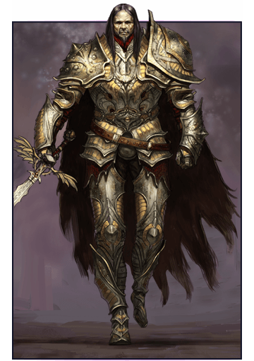

# 5. Séance 5

## Campagne

D&D 5 - Princes of Apocalypse Revisited

## Date

19/01/2020

## Lieu

Maison d'Alexandre

## MJ

Cyril

## Joueurs présents

Alex => Qerrak (niveau 5)  
Emily => Ura (niveau 5)  
JS => Lysianna (niveau 5)  
Julien => Albérich (niveau 5)  
Remy => Robin (niveau 5)  
Sébastien => Drachen (niveau 5)

## Partie

### Résumé

Le groupe passe une nuit tranquille dans la maison de **Aans** pendant qu'une tempête de neige fait rage au dehors.

Après avoir "emprunté" quelques denrées trouvées dans les placards, le groupe part au petit matin alors qu'un brouillard très dense entrave leur progression.

En milieu de matinée, le groupe croise la route d'une famille de [mammouths](https://www.aidedd.org/dnd/monstres.php?vf=mammouth).  
La mère mammouth protégeant son petit charge les aventuriers, qui la blessent en retour.  
**Lysianne** réussi à la faire fuir, mais dans un choc violent, l'objet désiré par **Rollo** a été endommagé.

Le groupe reprend son chemin, mais peu de temps après croise la route d'un groupe de trappeur, agacé d'avoir perdu la trace d'une famille de mamouths.  
Il s'en faut de peu que le combat démarre entre les 2 groupes.

Enfin, les aventuriers rejoignent la piste dans les montagnes qui leur permet de rejoindre `Mirabar`.  
**Lysianne** et **Robin**, avant de quitter les `plaines glacées`, s'essayent au patinage artistique avec plus ou moins de succès.

Le trajet de descente vers `Mirabar` se déroule sans encombre, et à une demi-journée de la ville, le groupe est intercepté par une délégation de **`l'ordre du gantelet`**, contenant **Bree** et **Tordek**.  
Ils sont menés par le **Vindicateur Dan Laytor**.  

