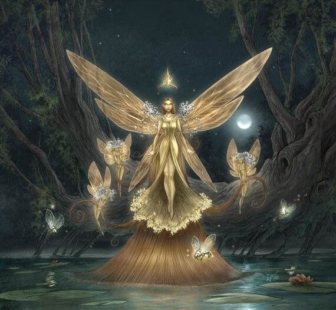

# 7. Séance 7

## Campagne

D&D 5 - Princes of Apocalypse Revisited

## Date

23/02/2020

## Lieu

Maison d'Alexandre

## MJ

Cyril

## Joueurs présents

Alex => Qerrak (niveau 5)  
Emily => Ura (niveau 5)  
JS => Lysianna (niveau 5)  
Julien => Albérich (niveau 5)  
Remy => Robin (niveau 5)  
Sébastien => Drachen (niveau 5)

## Partie

### Résumé

Exploration du `temple Utruz`.

- 3 => salle vide avec statues représentant des slaads (DD 25 pour reconnaitre)
- 4 => salle accessible avec piège magique Boule de feu (8d6 dégâts) déclenchés par le mot porte (ouvrir par le mot `Utruz`)
- 5 => bureau avec porte verrou magique (dispelable)
  - Bureau avec un [bouclier +1](https://www.aidedd.org/dnd/om.php?vf=bouclier-1-2-ou-3)
  - Dans un tiroir des outils de crochetage & 4 lettres d'invitations
  - Dans un tiroir vérouillé avec pièges flechette (DD 20) empoisonnée (4D8 + 2D6 / round 3 rounds) baguette de [projectiles magiques](https://www.aidedd.org/dnd/om.php?vf=baguette-de-projectiles-magiques) + clés de la porte menant à la salle 7 + 2 parchemins de détection des objets magiques
- 7 => salle contenant des toges de cérémonies
- 9 => Buffet à vaisselle vide
- 10 => Salle à manger avec grille vétuste fermée mais forçable. Trouve 1 fiole d'acide, 5 [potions de soins majeures](https://www.aidedd.org/dnd/om.php?vf=potion-de-soins)
- 15 (ouest) => 4 chambres avec dans la 3ème un [collier de prière](https://www.aidedd.org/dnd/om.php?vf=collier-de-perles-de-priere) dans commode fouille (DD 15)
- 19 => petite salle avec 2 [horreurs casquées](https://www.aidedd.org/dnd/monstres.php?vf=horreur-casquee) + porte vérouillée
- 20 => 1 grand prêtre `Utruz` et 4 magiciens `Utruz` sont en train d'invoquer une abbération [slaad funeste](https://www.aidedd.org/dnd/monstres.php?vf=slaad-funeste)
  - 4 anneaux de télépathie sur les magiciens `Utruz`
  - Corps sans vie avec beaucoup d'enfants
  - Au moment où ils entrent le prêtre sacrifie une jeune fille et se tue en suivant pour se plonger dans le puit
  - 4 mages sont alors déchiquetées par un slaad qui sort du puit
- 21 => salle avec 3 enfants dont **Fila**. Si parcours très rapide contient 5 enfants dont **Ban**.
- 22 => salle éboulée
- 23 => salle avec un autel au bout : Pour **Robin** intervention de son archiféé
- 24 => salle vérouillée avec coffre (piège flechettes (DD 20) empoisonnées) 3000 PO + 2000 PO gemmes + Oeuf de Wiverne
- 25 => salle éboulée

Au bout du couloir est et au bout du couloir après la salle 6, derrière 10m d'éboulement, se trouve l'artefact de la terre.

Contenu des courriers :
"Mes frères, nous avons été trahis par le faux prophète qui a tué beaucoup des nôtres, à nous de révéler la puissance du culte `Utruz`, en invoquant nos champions et en déversant sur ce monde notre colère. Retrouvez moi au site de nos origines, afin de reveler au monde la vrai puissance des `Utruz`."

**Robin** rencontre son archiféé **Verdia** au service de la reine **Titania**. 2 soeurs **Urdia** et **Suldia**.

Celle-ci lui demande de lui ramener l'artefact de l'air afin que **Titania** puisse combattre son adversaire la reine **Mab** féé de l'air et des ténèbres.
Elle lui annonce aussi de poursuivre ses recherches car il ne semble pas loin de l'artefact de la terre qui s'est activé récemment.

`Divination`

- La pierre attire la pierre,
- par les serpents avant d'être souillés,
- celle-ci protégeait les lieux.
- Pour des centaines d'années à l'abri des cieux,
- elle a préfére s'enfermer,
- sous des tonnes similaires.

A la sortie du temple, se trouve **Rollo** en compagnie d'une 40aine d'hommes de compagnie...

Il demande au groupe s'ils ont trouvé des enfants ...

**Fila** est en fait sa fille, née de son amour impossible avec **Dame Nestra Ruthiol**.

Cette dernière a préféré cacher cette naissance et demandé à son frère **Melien** de l'élever avec son fils **Ban** comme sa propre fille.

**Rollo** ancien capitaine de la garde de **Dame Nestra** a alors infiltré le `Zentharim` pour déjouer les plans de l'intérieur, mais il a appris que rien n'est tout blanc ou tout noir, et que des choses se trame, même pour `l'ordre du gantelet`.

Demande à ce que le groupe ramène **Fila**, après lui avoir donné son cadeau, à `Yartar` auprès de sa mère.

L'artefact => JdS SAGESSE DD20 sinon tente de toucher l'artefact
Si quelqu'un le touche :

- barrière prismatique sur l'artefact
- repoussé + 2D10 dégats de force
- perte 1D10 points constitution / force / sagesse
=> récupérable grâce à 3 restaurations suprêmes.

Albert & Laura
