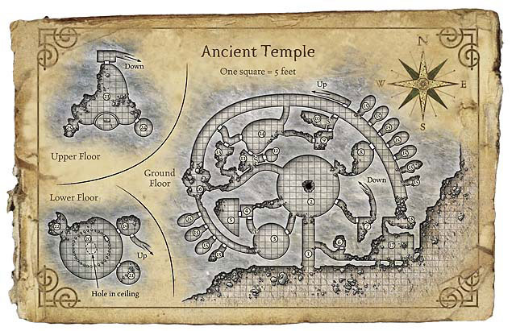

# 8. Séance 8

## Campagne

D&D 5 - Princes of Apocalypse Revisited

## Date

26/07/2020

## Lieu

Maison d'Alexandre

## MJ

Cyril

## Joueurs présents

Alex => Qerrak (niveau 6)  
Emily => Ura (niveau 6)  
JS => Lysianna (niveau 6)  
Julien => Albérich (niveau 6)  
Remy => Robin (niveau 6)  
Sébastien => Drachen (niveau 6)

## Partie

### Résumé

**Robin** relate au groupe sa rencontre avec sa fée gardienne ainsi que ce qui lui a été dit concernant le possible artefact de la terre.

> La pierre attire la pierre,
> par les serpents avant d'être souillés,
> celle-ci protégeait les lieux.
> Pour des centaines d'années à l'abri des cieux,
> elle a préfére s'enfermer,
> sous des tonnes similaires.

Le groupe se dirige donc de nouveau vers le temple `Utruz` dernier lieu qu'il a visité.

Après l'avoir fouillé de fond en comble et être parti sur de nombreuses conjectures plus ou moins avisées, le groupe décide alors de déblayer les éboulis au fond du couloir de l'est.

Après plusieurs demi-journées de labeur, **Drachen** et **Alberich** déblayent le passage vers une pièce encore inexplorée.

`Temple Utruz`

Le groupe se rend donc dans cette partie inexplorée du temple et découvre dans la pièce suivante, une pierre flottante entourée d'un halo lumineux.

**Querrark** est le seul à ne pas répondre au premier appel pour désigner le champion de la terre.

Tous les autres aventuriers ont prononcés leur nom et se retrouvent alors dans une caverne sans entrée ni sortie.

Un élémentaire de terre très grand se tient au centre de la pièce et leurs demande de se préparer au combat pour désigner le champion.

Après 2 rounds de combat, **Alberich** ayant subit les assauts violents de l'élémentaire s'effondre, et les aventuriers réintègrent alors la pièce qu'ils venaient de quitter dans le temple.

Au second appel, **Querrark** répond lui aussi présent et c'est le groupe en entier qui se retrouve une nouvelle fois dans la caverne.

Le combat tourne encore court lorsque cette fois **Lysianna** tombe sous les assauts de l'élémentaire et les aventuriers doivent répondre une troisième fois à l'appel.

Le troisième combat, voit **Drachen** tomber.

C'est au quatrième combat, qu'avec une tactique de groupe plus aboutie, les aventuriers résistent aux coups et à la pétrification générale.

**Querrark** est le dernier à resister et est de facto élu champion de la terre, titre qu'il accepte à contre-coeur, lui le natif du plan de l'air, de peur de voir l'artefact disparaitre.

L'artefact se soude alors au corps de **Querrark** et afin de prévenir les hauts-elfes de l'obtention du 1er artefact, le groupe se téléporte à `Néménora`.

**Leshanana** les accueille froidement, et refuse de croire que l'artefact a été trouvé ne décellant aucune magie puissante dans l'objet soudé au corps de l'aarakocra.

**Querrark** souhaite alors se débarasser de l'artefact, mais comprend que cela lui est impossible.

Dans la confusion et la panique générée **Leshanna** prend sur elle de découvrir ce qui perturbe à ce point les aventuriers.

Après quelques recherches et incantations, il s'avère que l'artéfact cache son pouvoir et la haut-elfe commence à croire les récits narrés par **Lysianna**.

**Querrark** de dépit et s'étant laissé convaincre par **Robin** de l'inutilité des hauts-elfes, décide de provoquer en duel **Leshanna** afin de savoir si elle est aussi puissante que son statut le laisse croire.

Au cours de l'affrontement, **Querrark** privé de ses sens et conseillé par **Leshanna** réussi à entrer en communication avec l'esprit de l'artefact et comprend alors qu'il est doté d'un outil puissant pouvant lui octroyer un pouvoir restant à découvrir. Le tout étant de l'accepter.

Le groupe repart alors à ses occupations dans la cité, mais **Robin** déçu par la réaction de **Leshanna**, est très aigri vis-à-vis des hauts-elfes.

**`FIN DE LA SEANCE`**

### Informations utiles

Les joueurs gagnent en tout `9000 points d'expérience` et passent **`Niveau 7`**.