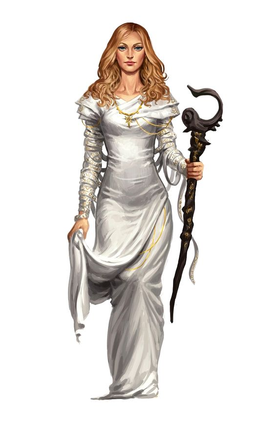

# Next session

## Luskan (p95)

Aucun information concernant un artéfact.  
Cherche à enroller pour le capitaine Suljack (3ème high capitaine).

Mission pour néttoyer la zone à 1 journée de mer de 4 kraken priest (p215 Volo Monster) + Dragon turtle (p 119 Monster manual).

Butin :

- 3000 PO
- Cotte de mailles en Mithral +1
- Amulette de respiration aquatique
- 1 dague de stockage de sort

Si cella est fait reconnaissance des pirates :

- 1 bateau avec équipage permanent 3 hommes mais a rémunérer

Il est conseillé au groupe de se rendre à `Ironmaster` ou `Fireshear`. Les nains sauront certainement ce qui se trame dans les mines et si un artéfact a fait son apparition.

## Fireshear

Ville cotière naine gérée par le clan nain **Barbedegivre**, actuellement **Garshuk Barbedegivre**. Activités essentiellement pêche et mines.

Groupe pas très bien reçu mais apaisement si **Alberich** sait se montrer social. Les nains ne parlent qu'à lui.

Auberge l'enclume larmoyante, gérée par Ruuk n'a pas l'habitude de représentation, mais si DD 25 celle-ci est fortement appréciée par les nains présent.

Allez a `Ironmaster` afin de trouver plus d'informations et un guide nommé **Bardek Barbedegivre** pourra les conduire.

## Ironmaster (p62)

Ville cotière naine gérée par **Storn Skulldark** fortifiée dans la roche, vivant des activités minières et de la pêche.

Auberge le marteau grésillant gérée par **Audhild** même accueil qu'à `Fireshear`. Se trouve **Bardek**.

Des histoires d'une ancienne mine abandonnée se situant un peu plus loin après `Hundelstone` et avant `Bryn Shander`, à 2 jours de marche à l'est font état d'activités récentes...
  
Attention, les aventuriers doivent être équipés contre le froid car en cette période (fin d'automne) et région du nord, le vent et la température sont féroces.

Pas d'information sur un artéfact, mais des informations sur des géants qui s'activent dans les montagnes entre `Hundelstone` et `Bryn Shander`.

## Hundelstone

Cité naine vivant des opérations minières. **Ilgoroth Barbegelée** cousin de **Tordek** gère les opérations de la cité.

Pas d'auberge précise, mais une maison avec une cantine et des dortoirs.  
La mine abandonnée est à 2 journées de marche vers l'est.

Si le groupe n'a pas encore recruté de guide, alors il peut en trouver un ici sous la personne de **Einkil Balderk**.

Activité des géants importante ces dernières semaines, notemment autour d'une vieille mine qu'ils pensaient désaffectées.

Une présence sombre semble avoir élue domicile au fond de cette mine, qui attire les monstres et autres groupes mauvais.

## Bryn Shander

Ville vivant du commerce et des activités minière et de la pêche. Ville gérée par **Taklinn Fortenclume**.  
Ce dernier est préoccupé par la recrudescence d'activité des géants dans la région, ainsi que des hordes de Barbares qui s'agitent.

Accueil bien plus chaleureux notemment à l'auberge de la pique givrante tenue par **Torgga**.

Aucune autre information si ce n'est cette mine qui semble attirer une activité intense de monstres, raids, et présence sombre depuis quelques semaines.

Si le groupe n'a pas encore recruté de guide, alors il peut en trouver un ici sous la personne de **Einkil Balderk**.

## Trajet vers la mine abandonnée

Rencontre avec 2 [géants du givre](https://www.aidedd.org/dnd/monstres.php?vf=geant-du-givre)

## Mine abandonnée

Elle est désaffectée mais une fois enfoncé à l'intérieur.

**Astrid** arrivent en courant en disant qu'une horde de [basilics](https://www.aidedd.org/dnd/monstres.php?vf=basilic) arrivent et qu'il faut s'enfoncer dans la mine.

La seule solution est de prendre 1 chariot afin de descendre plus profondément dans la mine.

Effectuer 4 jets de dextérité chacun pour des passages dangereux :

- DD 15 Dex pour éviter de tomber du chariot (3 jets réussis sur 6) => virage serré
- DD 15 For pour faire en sorte que le chariot penche sur la gauche (3 jets réussis sur 6) => rail droit défectueux
- DD 20 Dex pour éviter des stalagtites => cas d'échec assomé et 2D12+6 dégats assomants
- DD 25 Dex pour assurer le saut du chariot au dessus des rails effondrés avec avantage (4 jets sur 6)

Le chariot finit dans un mur à pleine vitesse si pas ralenti et donc tout le monde subit 4D6 de dégats.

## Ancien temple nain

## Couloir 23

- 2 Flail Snail (p144 Volo Monster)
- 1 Black pudding (p241 Monster manual)

## Salles 20 et 22

Elles sont piégées et fermées DD22 pour ouvrir et désamorcer.

A l'intérieur se trouve :

- Clibanion +1
- Hache à 2 mains +1

## Toutes les autres salles

Rien d'intéressant. Sauf avec jet de fouille (DD22), trouve 2 caissettes remplies de 888 PO en gemmes et pièces.

### Salle 16

Se trouve l'artefact de l'ombre. Il se présente comme étant **Varjot**.

Il prend possession du corps d'un des aventuriers (sauf Querrark qui entend la terre lui dire de ne pas s'en méler)

Dès qu'il est touché 2 fois il quitte le corps et se déplace sur un autre aventurier.

S'il est soigné pendant qu'il occupe un corps il sort automatiquement.

Une fois la possession finie l'aventurier qui vient d'être possédé effectue un jet d'intelligence pour résister au charme personne.
Au bout de 2 ratés successifs il est possédé jusqu'à la fin du combat.

**Varjot** désigne son champion sur le dernier possédé ou celui ayant fait le plus de dégâts.

A la fin du combat sa soeur **Kevyt** artéfact de la lumière, intervient et demande à l'aventurier qui aura soigné s'il veut bien devenir son champion.

Si personne n'a soigné, alors elle fait passer un test aux 2 soigneuses du groupe.

Une fois les chamions désignés, **Kevyt** donne la localisation des autres artéfacts :

- Artéfact de l'air se trouve dans les `Star Mounts`
- Artéfact de l'eau se trouve dans la `Mer de Moonshae`
- Artéfact du feu se trouve dans le `Desert d'Anauroch`

Si le groupe refuse, le combat commence (p212 Volo Monster) :

- Aura terreur 9m -> JS Sag 18
- Attaque enlève un point au hasard si DD 17 dans la carctéristique non réussi
- Convoque 2 paladins noirs (p211 Volo Monster)
- [Silence](https://www.aidedd.org/dnd/sorts.php?vf=silence)
- [Tentacule Noir d'Hevrad](https://www.aidedd.org/dnd/sorts.php?vf=tentacules-noirs-d-evard) => JS For ou Dex 18
- [Eclair de chaos](https://www.aidedd.org/dnd/sorts.php?vf=eclair-de-chaos) => 2D8 + 3D6 For
- [Télékinésie](https://www.aidedd.org/dnd/sorts.php?vf=telekinesie) => attire **Astrid**

Si **Varjot** réussit à attraper **Astrid** il ouvre un portail dimensionnel et se téléporte avec elle.  
S'il perd plus de 160 PV il est forcé par sa soeur à se téléporter.

Le portail reste quelques secondes, et les aventuriers peuvent l'emprunter.

Tout le long du combat il parle avec sa soeur qui lui demande d'arreter et d'épargner ces aventuriers.  
Le groupe n'entend pas la voie de la soeur mais entend **Varjot** lui répondre qu'il ne voit pas comment faire autrement.

Sa soeur n'est autre que l'artefact de la lumière nommée **Kevyt**.

Celle-ci choisit la personne qui c'est occupé de soigner les blessés

## Salles 14, 15, 17 et 18

Se trouve :

- Une tiare de sagesse +2
- Une épée courte +1

## Après le combat

**Robin** est apellé par sa patronne fée **Verdia** qui va lui remettre un objet puissant :

- Amulette d'emplacement de sort +2

Mais surtout le prévenir que la citée de `Néménora` a été attaquée.
S'ils activent leur sort de téléportation, celui-ci les mènent à la citée des Hauts-elfes qui a été dévastée par des attaques d'élémentaires du feu.

En fouillant, un sort de message a été laissé aux aventuriers disant que l'ensemble des elfes a été rappatriés dans leur citée et qu'ils entreront en contact avec eux.  
Un sort leur permettra de revenir de là où ils sont partis.
