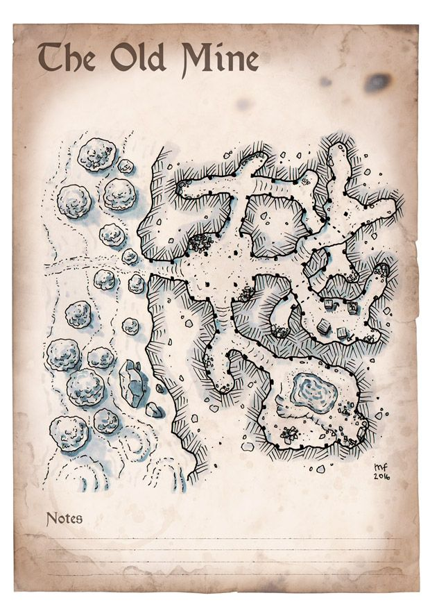
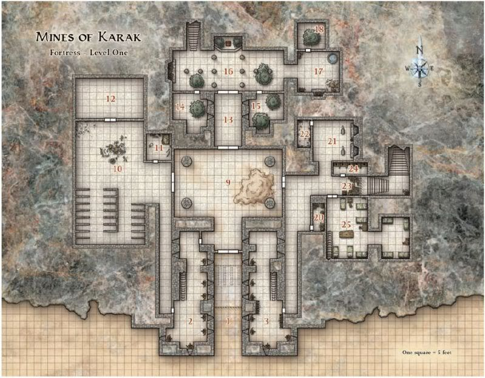
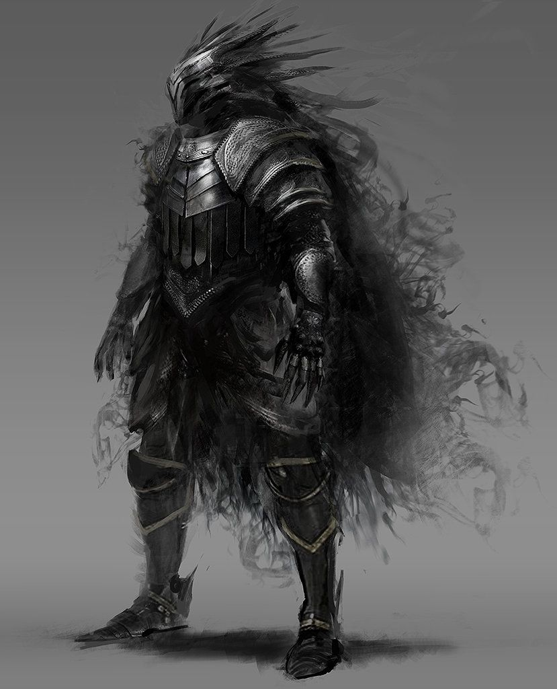

# Next session

## En route vers Icewind Dale

Au sortir de `Mirabar`, ou une demie-journée après le groupe est rejoint par une délégation de 4 gardes accompagnés d'**Astrid**.  
Celle-ci a été missionnée par `la guilde des seigneurs` pour accompagner le groupe et délivrer des messages aux villes portuaires en `Icewindale`.  ara
Nom des gardes :

- Sota
- Sotrop
- Simara
- Nangatra

Rencontre possible avec 2D4+1 de [Ankheg](https://www.aidedd.org/dnd/monstres.php?vf=ankheg)
Rencontre possible avec 2D6+2 [Orque](https://www.aidedd.org/dnd/monstres.php?vf=orque-chef-de-guerre) dont 2 chefs Berserker (+6 FOR +2 CON +20PV) et 2 chamans :

- [Soin](https://www.aidedd.org/dnd/sorts.php?vf=soins)
- [Attraction terrestre](https://www.aidedd.org/dnd/sorts.php?vf=attraction-terrestre)
- [Appel de la foudre](https://www.aidedd.org/dnd/sorts.php?vf=appel-de-la-foudre)
- [Boule de feu](https://www.aidedd.org/dnd/sorts.php?vf=boule-de-feu)
- [Eclair](https://www.aidedd.org/dnd/sorts.php?vf=eclair)
- [Hate](https://www.aidedd.org/dnd/sorts.php?vf=hate)
- [Lame de feu](https://www.aidedd.org/dnd/sorts.php?vf=lame-de-feu)
- [Trait de feu](https://www.aidedd.org/dnd/sorts.php?vf=trait-de-feu)

## Mirabar (p50)

Ville fortifiée dirigée par Selyn Raurim. Membre de l'alliance des seigneurs.

Ville riche vivant des exploitation minières sous la ville.

## Luskan (p95)

Ville pirate dirigée par 5 capitaines. Se trouve aussi la confrérie des Arcanes.

Auberge L'étoile du matin étincelante => attention représentation houleuse généralement conclue par une bagarre de taverne.

Aucun information concernant un artéfact.  
Cherche à enroller pour le capitaine Suljack (3ème high capitaine).

Mission pour néttoyer la zone à 1 journée de mer de 4 kraken priest (p215 Volo Monster) + Dragon turtle (p 119 Monster manual).

Butin :

- 3000 PO
- Cotte de mailles en Mithral +1
- Amulette de respiration aquatique
- 1 dague de stockage de sort

Si cella est fait reconnaissance des pirates :

- 1 bateau avec équipage permanent 3 hommes mais a rémunérer

Il est conseillé au groupe de se rendre à `Ironmaster` ou `Fireshear`. Les nains sauront certainement ce qui se trame dans les mines et si un artéfact a fait son apparition.

## Fireshear

Ville cotière naine gérée par le clan nain **Barbedegivre**, actuellement **Garshuk Barbedegivre**. Activités essentiiellement pêche et mines.

Groupe pas très bien reçu mais apaisement si **Alberich** sait se montrer social. Les nains ne parlent qu'à lui.

Auberge l'enclume larmoyante, gérée par Ruuk n'a pas l'habitude de représentation, mais si DD 25 celle-ci est fortement appréciée par les nains présent.

Des histoires d'une ancienne mine abandonnée se situant un peu plus loin après `Hundelstone` et avant `Bryn Shander`, à 2 jours de marche à l'est font état d'activités récentes...

Un nain **Bardek Barbedegivre** peut les y conduire.  
Attention, les aventuriers doivent être équipés contre le froid car en cette période (fin d'automne) et région du nord, le vent et la température sont féroces.

## Ironmaster (p62)

Ville cotière naine gérée par **Storn Skulldark** fortifiée dans la roche, vivant des activités minières et de la pêche.

Auberge le marteau grésillant gérée par **Audhild** même accueil qu'à `Fireshear`.

Pas d'information sur un artéfact, mais des informations sur des géants qui s'activent dans les montagnes entre `Hundelstone` et `Bryn Shander`.

Des guides plus à même de les accompagner peuvent être trouvés dans le ville de `Fireshear`.

## Hundelstone

Cité naine vivant des opérations minières. **Ilgoroth Barbegelée** cousin de **Tordek** gère les opérations de la cité.

Pas d'auberge précise, mais une maison avec une cantine et des dortoirs.  
La mine abandonnée est à 2 journées de marche vers l'est.

Si le groupe n'a pas encore recruté de guide, alors il peut en trouver un ici sous la personne de **Einkil Balderk**.

## Bryn Shander

Ville vivant du commerce et des activités minière et de la pêche. Ville gérée par **Taklinn Fortenclume**.  
Ce dernier est préoccupé par la recrudescence d'activité des géants dans la région, ainsi que des hordes de Barbares qui s'agitent.

Accueil bien plus chaleureux notemment à l'auberge de la pique givrante tenue par **Torgga**.

Aucune autre information si ce n'est cette mine qui semble attirer une activité intense de monstres, raids, et présence sombre depuis quelques semaines.

Si le groupe n'a pas encore recruté de guide, alors il peut en trouver un ici sous la personne de **Einkil Balderk**.

## Trajet vers la mine abandonnée

Rencontre avec 2 [géants du givre](https://www.aidedd.org/dnd/monstres.php?vf=geant-du-givre)

## Mine abandonnée

Elle est désaffectée mais une fois enfoncé à l'intérieur.

**Astrid** arrivent en courant en disant qu'une horde de [basilics](https://www.aidedd.org/dnd/monstres.php?vf=basilic) arrivent et qu'il faut s'enfoncer dans la mine.

La seule solution est de prendre 1 chariot afin de descendre plus profondément dans la mine.

Effectuer 4 jets de dextérité chacun pour des passages dangereux :

- DD 15 Dex pour éviter de tomber du chariot (3 jets réussis sur 6) => virage serré
- DD 15 For pour faire en sorte que le chariot penche sur la gauche (3 jets réussis sur 6) => rail droit défectueux
- DD 20 Dex pour éviter des stalagtites => cas d'échec assomé et 2D12+6 dégats assomants
- DD 25 Dex pour assurer le saut du chariot au dessus des rails effondrés avec avantage (4 jets sur 6)

Le chariot finit dans un mur à pleine vitesse si pas ralenti et donc tout le monde subit 4D6 de dégats.

## Ancien temple nain

## Couloir 23

- 2 Flail Snail (p144 Volo Monster)
- 1 Black pudding (p241 Monster manual)

## Salles 20 et 22

Elles sont piégées et fermées DD22 pour ouvrir et désamorcer.

A l'intérieur se trouve :

- Clibanion +1
- Hache à 2 mains +1

## Toutes les autres salles

Rien d'intéressant. Sauf avec jet de fouille (DD22), trouve 2 caissettes remplies de 888 PO en gemmes et pièces.

### Salle 16

Se trouve l'artefact de l'ombre. Il se présente comme étant **Varjot**.

Il veut **Astrid** pour lui et indiquera alors l'emplacement des 3 artéfacts à trouver.

Si le groupe accepte :

- Artéfact de l'air se trouve dans les `Star Mounts`
- Artéfact de l'eau se trouve dans la `Mer de Moonshae`
- Artéfact du feu se trouve dans le `Desert d'Anauroch`

**Varjot** ouvre un portail et le passe avec **Astrid**.
Alignement tendent vers le mauvais.

Si le groupe refuse, le combat commence (p212 Volo Monster) :

- Aura terreur 9m -> JS Sag 18
- Attaque enlève un point au hasard si DD 17 dans la carctéristique non réussi
- Convoque 2 paladins noirs (p211 Volo Monster)
- [Silence](https://www.aidedd.org/dnd/sorts.php?vf=silence)
- [Tentacule Noir d'Hevrad](https://www.aidedd.org/dnd/sorts.php?vf=tentacules-noirs-d-evard) => JS For ou Dex 18
- [Eclair de chaos](https://www.aidedd.org/dnd/sorts.php?vf=eclair-de-chaos) => 2D8 + 3D6 For
- [Télékinésie](https://www.aidedd.org/dnd/sorts.php?vf=telekinesie) => attire **Astrid**

Si **Varjot** réussit à attraper **Astrid** il ouvre un portail dimensionnel et se téléporte avec elle.  
S'il perd plus de 160 PV il est forcé par sa soeur à se téléporter.

Le portail reste quelques secondes, et les aventuriers peuvent l'emprunter.

Tout le long du combat il parle avec sa soeur qui lui demande d'arreter et d'épargner ces aventuriers.  
Le groupe n'entend pas la voie de la soeur mais entend **Varjot** lui répondre qu'il ne voit pas comment faire autrement.

Sa soeur n'est autre que l'artefact de la lumière nommée **Kevyt**.  
Elle a besoin d'un nouvel hôte, et son frère essaye de forcer ce dernier alors qu'elle préférerait discuter et l'acceptation de l'hôte.

## Salles 14, 15, 17 et 18

Se trouve :

- Une tiare de sagesse +2
- Une épée courte +1

## Après le combat

**Robin** est apellé par sa patronne fée **Verdia** qui va lui remettre un objet puissant :

- Amulette d'emplacement de sort +2

Mais surtout le prévenir que la citée de `Néménora` a été attaquée.
S'ils activent leur sort de téléportation, celui-ci les mènent à la citée des Hauts-elfes qui a été dévastée par des attaques d'élémentaires du feu.

En fouillant, un sort de message a été laissé aux aventuriers disant que l'ensemble des elfes a été rappatriés dans leur citée et qu'ils entreront en contact avec eux.  
Un sort leur permettra de revenir de là où ils sont partis.

## Portails

Si le groupe suit **Varjot** il se retrouve sur le plan du `gisombre`.
